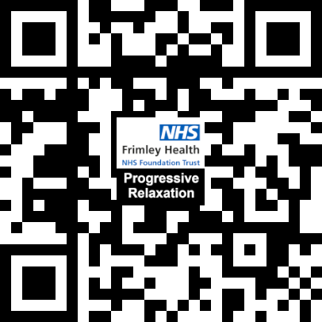

# pr

I suffered a heart attack in December 2021. As a result, early in 2022, I had to attend a cardiac rehab course run by my care team.

This page contains the Progressive Relaxation script used at the end of each session to help course participants calm our heart rate after our twice-weekly cardio exercise class.

## Loading the site

The site is hosted using Github Pages [here](https://bevand10.github.io/pr/). You can also use your mobile camera to scan this QR Code to load. The page features all the necessary config to use your phone's 'Add To Home Screen'.

